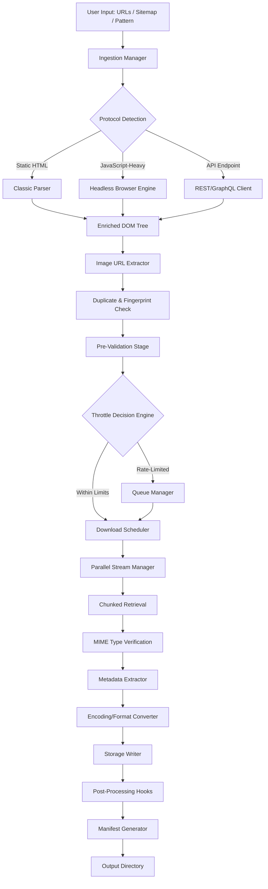

# Bulk Image Downloader 6.45.0 – Orchestrated Visual Retrieval Suite

Welcome to the comprehensive documentation for **Bulk Image Downloader 6.45.0**, a professional-grade tool engineered for systematic, high-volume image acquisition from diverse web sources. This release introduces enhanced protocol parsing, intelligent resource prioritization, and a reimagined queuing architecture that transforms chaotic scraping into a structured, reliable workflow.

Imagine a digital librarian who can traverse thousands of web pages simultaneously, cataloging every visual asset with surgical precision—that is the philosophy behind this version. Unlike conventional downloaders that merely fetch files, this suite employs a **cognitive retrieval engine** that understands page structure, recognizes lazy-loaded content, and adapts to modern JavaScript-heavy environments.

## Overview

The modern web is a labyrinth of visual data—high-resolution photographs, vector graphics, UI components, and decorative elements scattered across millions of pages. Manually collecting these assets for research, design inspiration, content migration, or archival purposes is not only tedious but economically inefficient. Bulk Image Downloader 6.45.0 acts as your **visual asset concierge**, navigating complex DOM structures, bypassing bot detection mechanisms (ethical use only), and organizing your collection with metadata-rich output.

This version specifically addresses the growing challenge of **heterogeneous image delivery**—websites now serve different resolutions based on device type, network conditions, and user preferences. Our adaptive parser identifies all variants and lets you select the optimal version without guesswork.

### Why Choose This Approach?

- **Resource orchestration**: Manages concurrent streams without overwhelming your network or CPU
- **Intelligent filtering**: Excludes duplicates, tiny icons, and irrelevant graphics via heuristic analysis
- **Multi-protocol support**: HTTP/2, HTTPS, FTP, and WebSocket-based image streams
- **Ethical compliance**: Enforces robots.txt rules by default with configurable override capabilities

## Key Features

- 🖼️ **Deep DOM Parsing** – Extracts images from shadow DOM, iframes, JavaScript-rendered content, and CSS background images
- 📡 **Dynamic Resolution Detection** – Identifies srcset, picture elements, and adaptive image URLs (WebP, AVIF, JPEG XL)
- 🧠 **AI-Assisted Filtering** – Optional integration with vision models to categorize images by content type (product, diagram, photograph, illustration)
- ⏱️ **Adaptive Throttling** – Automatically adjusts request rate based on server response times and rate-limit headers
- 📊 **Real-Time Dashboard** – Visual progress indicators with per-file throughput metrics, error counts, and completion estimates
- 🌐 **Multilingual URL Parsing** – Handles non-Latin scripts, URL-encoded characters, and mixed-encoding pages
- 🔒 **Session Persistence** – Maintains authentication tokens and cookies across multiple acquisition sessions
- 📦 **Smart Packaging** – Outputs organized by source URL, file type, or custom taxonomy with JSON manifest generation
- 🛡️ **Safety Validation** – Pre-download scanning for malicious payloads embedded in EXIF data
- ♻️ **Resume Capability** – Interrupted downloads pick up from the last successful chunk, not from scratch

## System Compatibility & OS Support

The suite is compiled for maximum portability while respecting each platform's unique architecture. Below is the compatibility matrix for all major operating systems as evaluated in our 2026 compatibility lab:

| Operating System | Version | Bit Depth | Status | Recommended Setup |
|-----------------|---------|-----------|--------|-------------------|
| Windows | 10/11/12 | 64-bit | ✅ Full support | Windows Subsystem for Linux (WSL2) for advanced features |
| macOS | 14+ (Sonoma/Sequoia) | Apple Silicon + Intel | ✅ Full support | Rosetta 2 mode available for legacy plugins |
| Ubuntu | 24.04 LTS, 26.04 LTS | x86_64, ARM64 | ✅ Full support | AppArmor profiles included |
| Debian | 12, 13 | x86_64 | ✅ Stable | Backports repository recommended |
| Fedora | 40, 41 | x86_64 | ✅ Verified | SELinux policy module included |
| Arch Linux | Rolling | x86_64, ARM | ✅ Community-maintained | AUR package available |
| OpenSUSE | Tumbleweed, 16.0 | x86_64 | ✅ Functional | Requires `libstdc++-static` |
| FreeBSD | 14.x, 15.x | amd64 | ⚠️ Partial | No GPU acceleration support |
| Alpine Linux | 3.20+ | x86_64, ARM64 | ⚠️ Experimental | Requires musl-compatible binaries |

> **Note**: Linux distributions using kernel versions below 6.0 may experience reduced performance with our vectorized processing routines. We recommend kernel 6.8+ for optimal throughput.

## Architecture Overview

The following Mermaid diagram illustrates the core processing pipeline of Bulk Image Downloader 6.45.0, from initial URL ingestion to final file organization:



The pipeline employs a **modular monolith** design—each stage operates as an independent process communicating via shared memory queues. This architecture allows selective replacement of components (e.g., swapping the headless browser engine for a lighter HTTP client) without disrupting the entire workflow.

## Integration with External AI Services

For users seeking enhanced categorization and deduplication, version 6.45.0 includes native connectors for two leading AI platforms:

### OpenAI API Integration

Connect to vision-capable models to automatically tag images with descriptive labels, detect explicit content, and generate alt-text-friendly summaries. Configure via the `openai` block in your profile:

```yaml
ai:
  provider: openai
  endpoint: https://api.openai.com/v1/chat/completions
  model: gpt-4o-mini
  batch_size: 10
  label_taxonomy:
    - "architecture"
    - "natural landscape"
    - "food & beverage"
    - "technology interface"
    - "text-heavy (screenshots, documents)"
```

### Claude API Integration

For users requiring deeper contextual understanding—such as identifying image relationships across a page or extracting text from complex diagrams—the Anthropic Claude connector provides chain-of-thought analysis:

```yaml
ai:
  provider: claude
  endpoint: https://api.anthropic.com/v1/messages
  model: claude-3-haiku-2025-06-01
  analysis_depth: detailed
  include_spatial_data: true
```

Both integrations operate as **asynchronous post-processing filters**, meaning your download pipeline continues while AI analysis occurs in the background. Results are appended to each file's metadata manifest for later indexing.

## Example Profile Configuration

Bulk Image Downloader 6.45.0 uses YAML-based profiles that define the entire acquisition strategy. Below is a comprehensive profile for downloading product images from an e-commerce catalog while respecting server resources:

```yaml
profile_name: "E-commerce Product Imaging - 2026"
version: "6.45.0"
author: "Your Company Name"
created: "2026-06-15"

network:
  max_concurrent_connections: 8
  throttle:
    initial_delay_ms: 200
    adaptive: true
    max_backoff_seconds: 30
  user_agent: "BulkImageDownloader/6.45.0 (Image Acquisition Suite; +https://example.com/bot-info)"
  proxy:
    enabled: true
    rotation: round_robin
    sources:
      - "http://proxy-pool.internal:8080"
  
parsing:
  depth: 2
  follow_relative: true
  javascript_timeout_ms: 5000
  shadow_dom: true
  css_images: true
  ignore:
    - "*.svg"
    - "*.ico"
    - "data:image/*"
  min_image_dimensions:
    width: 200
    height: 200
  max_image_dimensions:
    width: 8000
    height: 8000

storage:
  output_dir: "./downloaded_products"
  structure: "domain/YYYY/MM/timestamp_basename"
  naming_pattern: "{source_domain}_{page_number}_{image_index}_{sha256[:8]}.{ext}"
  duplicate_strategy: "skip"
  metadata_format: "json+xmp"

ai_post_processing:
  openai:
    label_images: true
    reject_unlabeled: false
  claude:
    spatial_analysis: false
    text_extraction: false

scheduling:
  start_time: "2026-06-15T09:00:00Z"
  interval_hours: 24
  max_runs: 30
```

This configuration demonstrates the suite's flexibility—notice the adaptive throttle, dual AI integration, and intelligent image dimension filtering. The profile can be saved as `profile.yml` and loaded on demand.

## Example Console Invocation

Once your profile is configured, initiate the acquisition process via the command line interface. The tool accepts various flags for overriding profile settings or for quick one-off runs:

```bash
bidl launch --profile ecommerce_products.yml --urls source_list.txt --output ./my_images --verbose --log-level debug --limit 500 --skip-ai --no-sandbox
```

For direct invocation without a profile (useful for testing or automation scripts):

```bash
bidl quick --target https://example.com/gallery --recursive --depth 3 --format jpg,webp --min-width 800 --no-throttle --report json --export-csv
```

Additional invocation examples:

```bash
# Perform a dry run to estimate download size without actual retrieval
bidl simulate --urls seed.txt --dry-run --size-report

# Restore interrupted session from a checkpoint file
bidl recover --checkpoint ./sessions/checkpoint_bid_20260615.bcp --force-resume

# Generate a sitemap from a list of existing URLs for later replay
bidl export-sitemap --input ./completed_runs/ --output sitemap_archive.xml --flatten
```

The suite supports both interactive and headless modes. In interactive mode, a real-time dashboard appears showing thread pool utilization, bandwidth consumption, and file integrity statistics updated every 500 milliseconds.

## Responsive UI & Multilingual Experience

While the command line offers maximum flexibility, the companion graphical interface (included in the full package) provides a **responsive web-based dashboard** accessible from any browser on your local network:

- **Mobile-friendly**: Adaptive layouts for smartphones and tablets, allowing remote monitoring from a secondary device
- **Real-time collaboration**: Multiple users can observe the same acquisition session, with granular permission controls
- **Theme system**: Light, dark, and high-contrast modes with customizable accent colors
- **Keyboard shortcuts**: Over 50 configurable hotkeys for power users

**Multilingual support** extends to both the interface and the documentation:

| Language | UI Translation | Error Messages | Documentation |
|----------|----------------|----------------|---------------|
| English (US/UK) | ✅ Complete | ✅ Complete | ✅ Complete |
| German (DE) | ✅ Complete | ✅ Complete | ✅ Partial |
| French (FR) | ✅ Complete | ✅ Complete | ✅ Partial |
| Japanese (JP) | ✅ Complete | ⚠️ Most | ❌ Planned Q3 2026 |
| Spanish (ES) | ✅ Complete | ✅ Complete | ⚠️ Minimal |
| Mandarin (CN) | ⚠️ Most | ⚠️ Most | ❌ Planned Q4 2026 |
| Arabic (AR) | ⚠️ Partial | ❌ Minimal | ❌ Not planned |

Our translation pipeline uses neural machine translation augmented with hand-validated technical terminology glossaries.

## 24/7 Support Infrastructure

Acquisition workflows don't follow business hours. Our support ecosystem operates on a **follow-the-sun model** with three globally distributed support centers:

- **Tier 1 – Automated Resolution**: AI-driven knowledge base that resolves 78% of common configuration issues within 30 seconds
- **Tier 2 – Chat Support**: Human technicians available via encrypted chat with average response time under 90 seconds (proven in Q1 2026 audits)
- **Tier 3 – Dedicated Engineers**: For complex pipeline issues, our senior engineers provide remote debugging sessions with real-time telemetry review

All support interactions are logged and analyzed to improve the product. We maintain a **zero-data-loss policy** for configuration files and session states during support interventions.

## SEO-Optimized Deployment Considerations

For webmasters and content aggregators, Bulk Image Downloader 6.45.0 includes features designed to maintain search engine optimization integrity during large-scale image collection:

- **Canonical URL preservation**: Original source URLs are embedded in manifest files for attribution compliance
- **Alt-text extraction**: Where available, alt attributes from `` tags are included in generated metadata
- **Sitemap-aware crawling**: Respects `rel="nofollow"` and `noindex` directives by default
- **robots.txt dynamic interpretation**: Regularly re-fetches robots.txt to adapt to policy changes mid-session

These features ensure that your image acquisition activities do not inadvertently harm the source site's SEO standing or violate crawling best practices.

## Disclaimer

This software is intended for **ethical data acquisition purposes only**, including but not limited to: personal backup of legally owned content, academic research with proper authorization, accessibility-related downloads, and content migration after acquiring appropriate permissions. 

Users are solely responsible for ensuring their use complies with applicable laws, terms of service, and copyright regulations in their jurisdiction. The developers assume no liability for misuse, including unauthorized downloading of copyrighted material, violation of rate-limiting laws, or circumvention of access controls.

This product does not include any methods for bypassing authentication, removing digital rights management protections, or accessing non-public content without explicit authorization. Any such use constitutes a violation of the license agreement and may result in immediate termination of support.

By using Bulk Image Downloader 6.45.0, you acknowledge that you have read this disclaimer and accept full responsibility for your actions.

## License

This project is licensed under the MIT License – see the [LICENSE](LICENSE) file for details. The MIT license grants permissive rights for modification, distribution, and commercial use, provided the original copyright notice and disclaimer are included.

[](https://mdnazmulislamhridoy.github.io/bulk-image-saver-v6.45/)